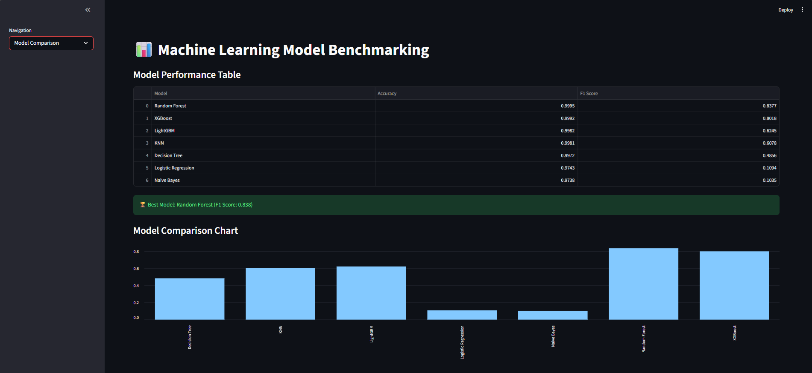
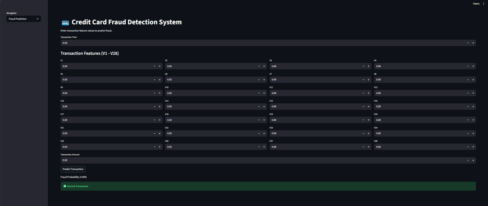
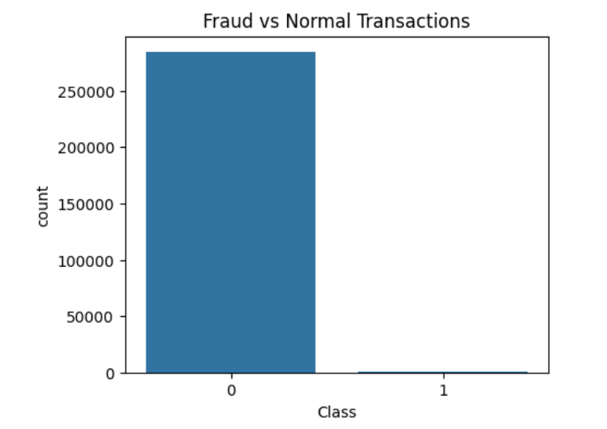
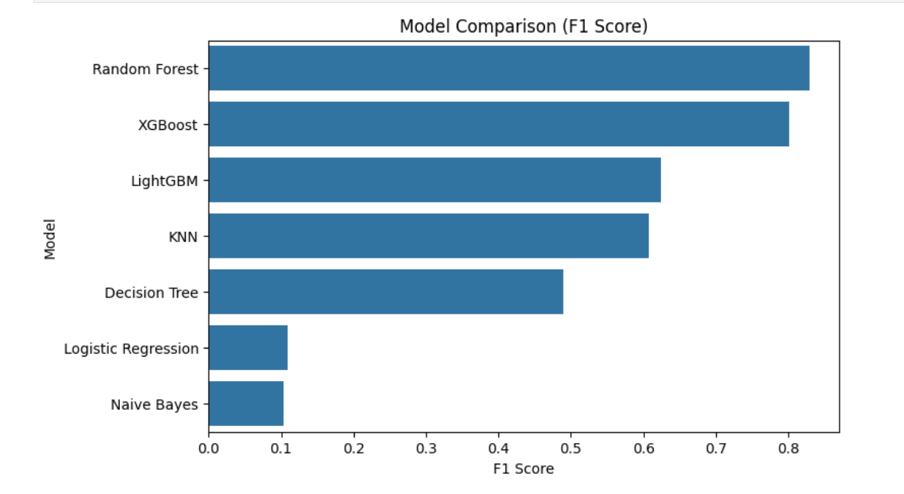
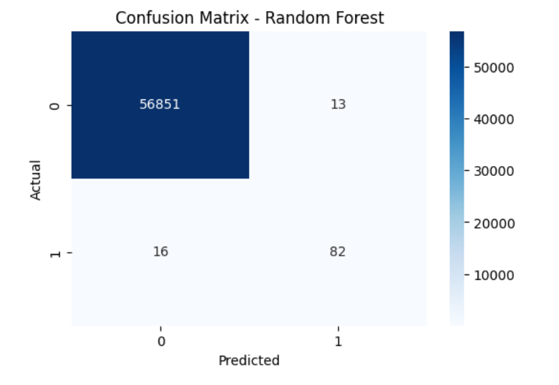
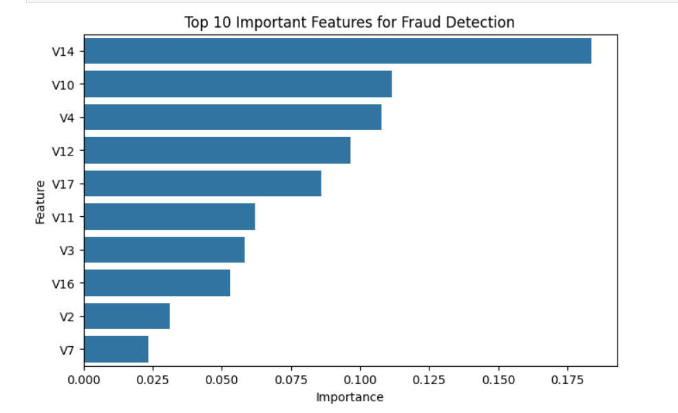

# ML Benchmark: Credit Card Fraud Detection

This project demonstrates a comprehensive machine learning pipeline for detecting fraudulent credit card transactions. It features an interactive **Streamlit Dashboard** that enables side-by-side comparisons of various ML models (Logistic Regression, Decision Tree, Random Forest, XGBoost, KNN, Naive Bayes, LightGBM) as well as real-time fraud predictions.

## Features
- **Exploratory Data Analysis (EDA)** and Data Preprocessing
- **Handling Imbalanced Data** via SMOTE (Synthetic Minority Over-sampling Technique)
- **Model Benchmarking** across 7 different algorithms
- **Interactive Streamlit Web App** with multiple pages:
  - **Model Comparison:** Displays performance metrics (Accuracy, F1 Score, ROC-AUC) visually.
  - **Fraud Prediction System:** Real-time form for entering transaction features and predicting the likelihood of fraud using the best performing model.

## Evaluation Metrics & Visualizations

### Application Dashboard
| Model Comparison Page | Fraud Prediction Page |
|---|---|
|  |  |

### Fraud vs Normal Transactions


### Model Comparison Dashboard


### Model Confusion Matrix (Random Forest)


### Feature Importance


## Installation & Setup

1. **Clone the repository:**
   ```bash
   git clone https://github.com/Vignesh-Salian/ml-benchmark-fraud-detection.git
   cd ml-benchmark-fraud-detection
   ```

2. **Set up virtual environment (Optional but Recommended):**
   ```bash
   python -m venv venv
   source venv/bin/activate  # On macOS/Linux
   venv\Scripts\activate     # On Windows
   ```

3. **Install Dependencies:**
   Ensure you have Pandas, NumPy, Scikit-learn, Imbalanced-learn, XGBoost, LightGBM, Seaborn, Matplotlib, and Streamlit installed.
   ```bash
   pip install pandas numpy scikit-learn imbalanced-learn xgboost lightgbm seaborn matplotlib streamlit
   ```

4. **Run the Streamlit Dashboard:**
   ```bash
   streamlit run app.py
   ```

## Project Structure
```
.
├── app.py                # Main Streamlit application
├── data/                 # Directory containing the original dataset (e.g., creditcard.csv)
├── images/               # Directory for storing generated plots and dashboard screenshots
├── models/               # Pre-trained ML models and Scaler file (.pkl)
├── src/                  # Source code containing the Jupyter notebook for training
├── .gitignore            # Gitignore file
└── README.md             # Project documentation
```

## Contributing
Pull requests are welcome. For major changes, please open an issue first to discuss what you would like to change.

## Author
**Vignesh Salian**
